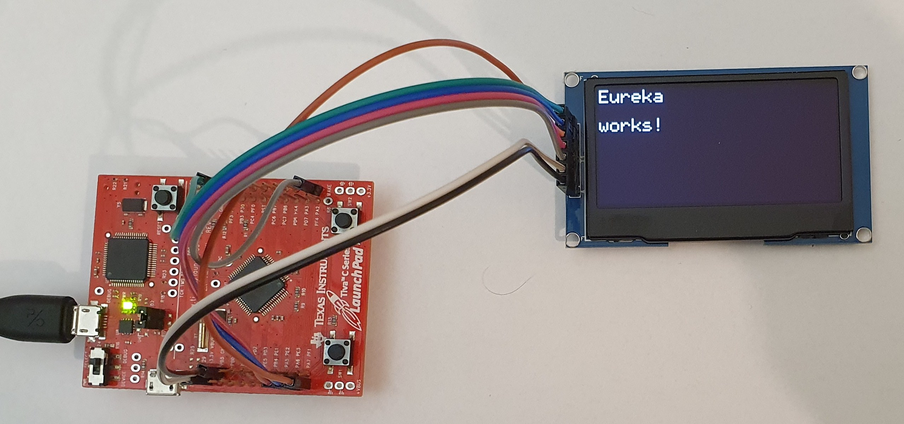

TIVA-C-Launchpad (TM4C123) + SSD1309 OLED Example (SPI)
=======================================================

Use the SSD1309 via SPI. The display module was `this model <https://www.amazon.de/gp/product/B08RBYMBML/ref=ppx_yo_dt_b_asin_title_o00_s00?ie=UTF8&psc=1>`_
which can be changed between using I2C and SPI by adjusting three different resistors. This example is using **SPI**.

.. list-table:: Wireing
   :widths: 50 50
   :header-rows: 1
 
   * - OLED pin
     - TIVA-C-Launchpad pin
   * - CS
     - GND
   * - DC
     - PA6
   * - RES
     - PA7
   * - SDA
     - PA5
   * - SCL
     - PA2
   * - VCC
     - 3.3V
   * - GND
     - GND

Requirements
------------

 * openocd
 * gnu debugger (gdb)

You may have to adjust `[runner]` section in `.cargo/config.toml` to use your gnu-debugger.

Add the `rust` compilation target for the Tiva-c-launchpad board:

.. code:: bash

    rustup target add thumbv7em-none-eabihf

After that run in one terminal:

.. code:: bash

    openocd

Open a second terminal and:

.. code:: bash

    cargo run

After the debugger has started hit `c` + `return` twice to continue stepping into the program.

This should display the message.
